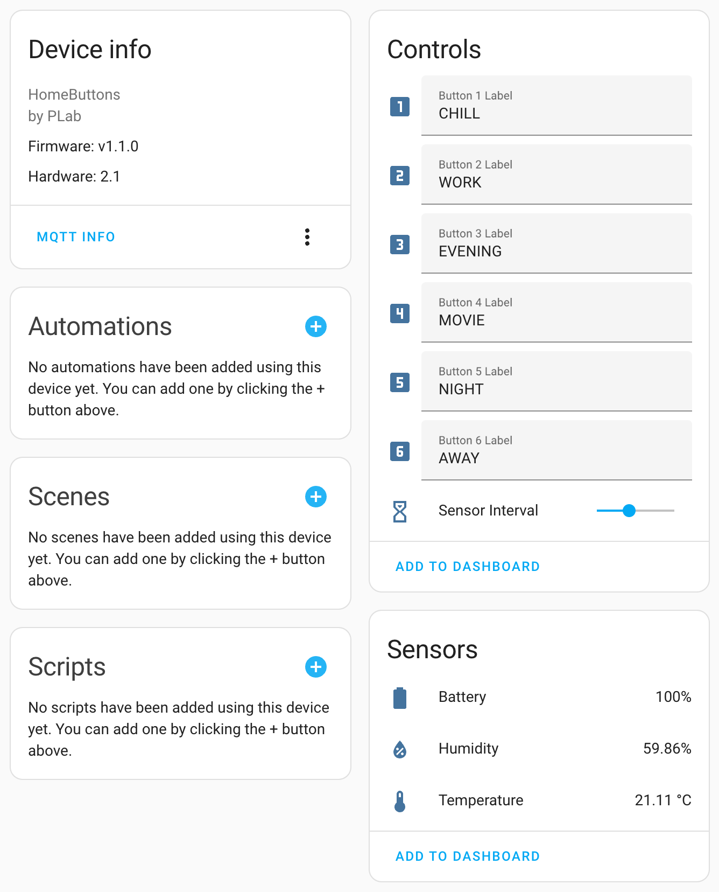

# Home Buttons

**An open source device for controlling your smart home.**

Works seamlessly with *Home Assistant*.

{width="325"} 

**Features:**

- 2.9" e-paper display
- 6 trigger buttons, multiple press support
- Wi-Fi connectivity
- Less than 1 second from button press to triggered action
- Temperature & humidity sensor
- Power options: Battery, USB-C, 5V DC
- Greater than 1 year battery life
- USB-C charging
- Compact size: 87 x 87 x 23 mm

---

## How It Works

**Always forgetting which button triggers which automation?**

{width="325"}

With *Home Buttons* you can assign a short label to each button.

The device uses an e-paper display, which enables the labels to be shown permanently, without consuming any power.

The labels can be changed directly in *Home Assistant*. You also define what happens when a button is pressed in *Home Assistant*.

*Home Buttons* communicates with *Home Assistant* via the MQTT protocol on a local network. No cloud required.

Device's page in *Home Assistant*:

{width="500"}

---

## Where To Get

You can buy *Home Buttons* on [*Tindie*](https://www.tindie.com/products/plab/home-buttons/){:target="_blank"} or
[*Lectronz*](https://lectronz.com/products/home-buttons).

---

## Getting Started

Set up you device with the help of [Getting Started](setup.md) guide.

---

## License

- The software is **open source** and licensed under the GNU GPLv3.  
- The hardware is **open source** and licensed under the CERN-OHL-S-2.0.