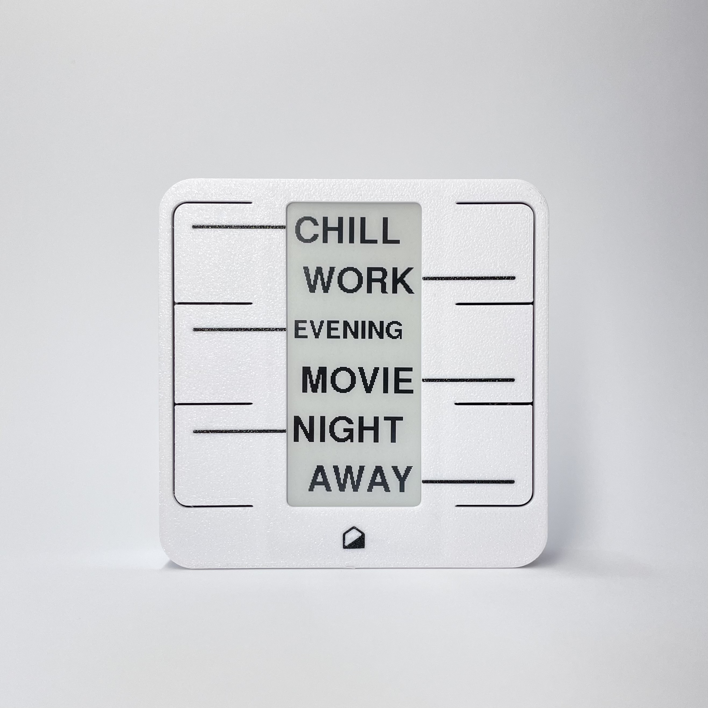

---
hide:
  - navigation
  - toc
---

# Home Buttons

**Open source devices simplifying your smart home.**

*Designed for Home Assistant :simple-homeassistant:.*

[normal + mini photo]

- Convenient Wi-Fi connectivity
- Less than 1 second from button press to triggered action (depending on your network)
- Temperature & humidity sensor
- Easy to set up and use

---

## How It Works

{align=left width="400"}

***Home Buttons*** lets you control you smart home in a simple and intuitive way. With a couple of push buttons, you can set scenes, control lights, trigger automations, and more.

You can set a label for each button, so you always know what it does. The labels are shown on an e-paper display, making them easily changeable as your smart home evolves. All while consuming next to no power.

The labels can be changed directly in *Home Assistant*. The same is true for setting up button actions.

*Home Buttons* communicates with *Home Assistant* via the MQTT protocol on a local network. No cloud required.

> It's also possible to use *Home Buttons* without *Home Assistant*. It can be integrated into most smart home systems that support MQTT, though some features may not be available.

---

## Devices

### Home Buttons Mini

{align=left width="400"}

Compact device with 4 buttons and a 1.5" display. Supports icons as labels. Powered by AA batteries with up to 2 years of battery life.

**Features**:

- 4 push buttons, multiple press support
- 1.5" e-paper display
- *Material Design Icons* :material-emoticon-cool-outline:
- Temperature & humidity sensor
- 2x AA batteries
- 1-2 year battery life
- Compact size: 64 x 64 x 20 mm

[*Learn more...*](mini/)

---

### Home Buttons

{align=left width="400"}

The original *Home Buttons*. Larger device with 6 buttons and a 2.9" display. Supports both text labels and icons. Can be powered by a rechargeable Li-Ion battery, USB-C, or 5V DC.

**Features**:

- 6 push buttons, multiple press support
- 2.9" e-paper display
- Text labels and *Material Design Icons* :material-emoticon-cool-outline:

- Temperature & humidity sensor
- Power options: 18650 Li-Ion Battery Cell, USB-C, 5V DC
- Greater than 1 year battery life
- Compact size: 87 x 87 x 23 mm

[*Learn more...*](original/)

---

## Where To Get

You can buy *Home Buttons* on [*Tindie*](https://www.tindie.com/products/plab/home-buttons/){:target="_blank"} or
[*Lectronz*](https://lectronz.com/products/home-buttons).

