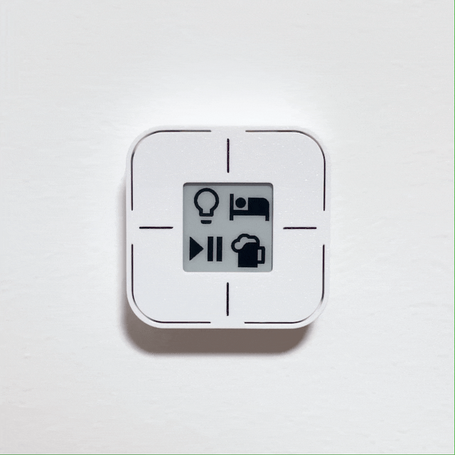

---
hide:
  - navigation
  - toc
---

# Home Buttons

**Open source devices simplifying your smart home.**

*Designed for Home Assistant :simple-homeassistant:.*

{align=center width="700"}

---

{align=right width="300"}

***Home Buttons*** lets you control you smart home in a simple and intuitive way.  
With a couple of push buttons, you can set scenes, control lights, trigger automations, and more.

The device features an e-paper display that shows a label for each button. So you always know what it does!  
All while consuming next to no power.

The labels and button actions can be easily configured directly in *Home Assistant*.

*Home Buttons* communicates via the MQTT protocol on a local network. No cloud required.

> It's also possible to use *Home Buttons* without *Home Assistant*. It can be integrated into most smart home systems that support MQTT, though some features may not be available.

---

## Devices

### Home Buttons Mini

{align=left width="400"}

Compact device with 4 buttons and a 1.5" display. Supports icon labels. Powered by AA batteries with up to 2 years of battery life.

**Features**:

- 4 push buttons, multiple press support
- 1.5" e-paper display
- *Material Design Icons* :material-emoticon-cool-outline:
- Temperature & humidity sensor
- 2x AA batteries
- 1-2 year battery life
- Compact size: 64 x 64 x 20 mm

[*Learn more...*](mini/)

---

### Home Buttons

{align=left width="400"}

The original *Home Buttons*. Larger device with 6 buttons and a 2.9" display. Supports both text labels and icons. Can be powered by a rechargeable Li-Ion battery, USB-C, or 5V DC.

**Features**:

- 6 push buttons, multiple press support
- 2.9" e-paper display
- Text labels and *Material Design Icons* :material-emoticon-cool-outline:
- Temperature & humidity sensor
- Power options: Rechargeable 18650 Li-Ion Battery Cell, USB-C, 5V DC
- Greater than 1 year battery life
- Compact size: 87 x 87 x 23 mm

[*Learn more...*](original/)

---

### Home Buttons Industrial

{align=left width="350"}

A device featuring industrial-grade buttons and a rugged aluminum enclosure. Does not have a display. Powered by USB-C or 7-32 V DC. Ideal for garages and workshops.

**Features**:

- Rugged industrial design with outstanding tactile feedback
- Illuminated momentary buttons (adjustable brightness)
- Buttons can be configured as triggers or switches
- Kill switch
- Wi-Fi connectivity
- Power options: USB-C (2 m cable included) or 7-32 V DC power

[*Learn more...*](industrial/)

---

## Where To Get

You can buy *Home Buttons* on [*Tindie*](https://www.tindie.com/stores/plab/?ref=offsite_badges&utm_source=sellers_nplan&utm_medium=badges&utm_campaign=badge_medium){:target="_blank"} or
[*Lectronz*](https://www.lectronz.com/stores/plab).

---

## License

- The software is **open source** and licensed under the GNU GPLv3.  
- The hardware is **open source** and licensed under the CERN-OHL-S-2.0.
