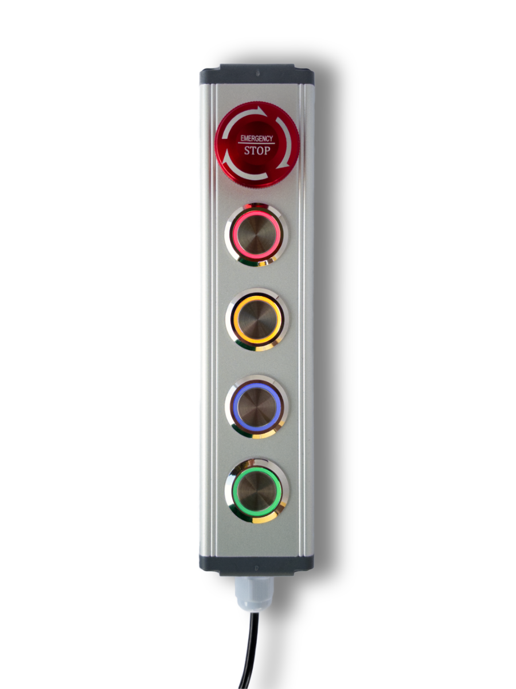

# Home Buttons Industrial

{width="350"} 

**Features:**

- Rugged industrial design with outstanding tactile feedback
- Illuminated momentary buttons (adjustable brightness)
- Buttons can be configured as triggers or switches
- Kill switch
- Wi-Fi connectivity
- Power options: USB-C (2 m cable included) or 7-32 V DC power

---

## Getting Started

Set up you device with the help of [Getting Started](setup.md) guide.

---

## Where To Get

You can buy *Home Buttons Industrial* on [*Tindie*](https://www.tindie.com/products/plab/home-buttons-industrial/?ref=offsite_badges&utm_source=sellers_nplan&utm_medium=badges&utm_campaign=badge_medium){:target="_blank"} or
[*Lectronz*](https://www.lectronz.com/products/home-buttons-industrial).

---

## Technical Specifications

### Physical

- Width: 45 mm
- Height: 200 mm
- Depth: 45 mm
- Metal buttons
- Aluminum enclosure
- Weight: 380 g

### User Interface

- 4x Illuminated momentary button
    - Different colors
    - Adjustable brightness
    - Can be configured as a trigger or a switch
- 1x Kill switch
    - Rotate to reset

### Connectivity

- 2.4Ghz WiFi
    - MQTT protocol *(Supports MQTT Discovery)*
- USB Type-C connector
    - Charging
    - Firmware update *(USB DFU mode)*
    - Debug messages *(USB CDC mode)*

### SoC

- ESP32-S2
    - Xtensa® Single­Core 32­bit LX7
    - Integrated WiFi modem: IEEE 802.11 b/g/n (2.4 GHz Wi­Fi)
- Supports OTA (Over-The-Air firmware update)
- Native USB for firmware update and debug
- Advanced security features

### Power

- Options
    - Any USB-C power supply via included 2 m USB-C cable
    - 7-32 V DC power supply (USB-C cable )