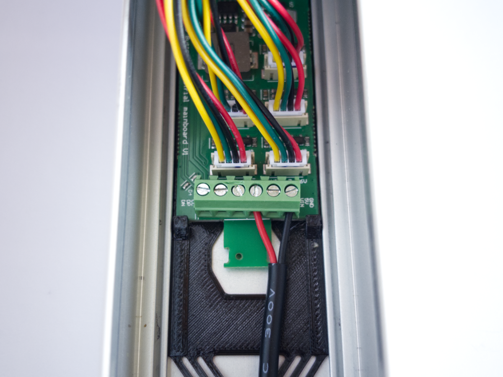

# Getting Started

**Setup up your *Home Buttons Industrial* in a few simple steps!**

You will need:

1. Depending on the desired power source (one out of):
    - USB-C power brick
    - 7-32 V DC power supply with a cable
1. 2x mounting screws with anchors suitable for your walls ***or*** double sided tape (must stick to plastic well)
1. A Wi-Fi network
1. An MQTT broker
1. *Home Assistant* (optional - can work only through MQTT)

## Connect Power

The device comes with a 2 m USB-C cable attached. Just plug it into a USB-C power brick.

Alternatively, you can connect a 7 - 32 V DC power supply to the screw terminals directly:

1. Unscrew 4 screws holding the front panel of the device and carefully remove it.
1. Disconnect the USB-C cable connector
1. Unscrew the cable gland. Feed some cable into the case to expose the safety zip tie and cut it off carefully. Now you can pull the cable out (connector fits through the gland)
1. Remove the connector adapter board from the screw terminals
1. Route you cable through the gland and connect the wires to GND and VIN terminals (see markings on PCB).
1. You can use the PCB tab in front of the screw terminals to secure the cable with a zip tie.

{width="400"}

> Make sure to connect the wires correctly. The red wire is positive, and the black wire is negative.

## Set Up MQTT Broker

*Home Buttons* requires an MQTT broker. If you don't already use it, you should install one now.
See this [page](https://www.home-assistant.io/integrations/mqtt/){:target="_blank"} for more information.
Usually, the simplest way is to install *Mosquitto MQTT* as a *Home Assistant* add-on.

> If you're using *Mosquitto MQTT* add-on, you must use username and password of your *Home Assistant* account. It's recommended to create a new account for use with MQTT.

If you don't use *Home Assistant*, see [Minimal Setup](../minimal.md) guide.

## Set Up Wi-Fi Connection {#setup_wifi}

After connecting the power, button will start pulsing. This indicates that *Home Buttons* is in settings menu. Press the :orange_circle: orange button to start Wi-Fi setup. The :orange_circle: orange button will start pulsing.

> Settings menu exits automatically after 30 seconds. To re-enter the settings menu, press and hold any 2 buttons simultaneously until the button lights start pulsing.

1. *Home Buttons* establishes a Wi-Fi hotspot for configuration.
Connect to the network named `HB-XXXXXX` with your device. The password is `password123`.

2. After connecting to the Wi-Fi network with your device, a **captive portal** will pop up automatically.
If it doesn't, open the web browser and navigate to http://192.168.4.1.

    {width="200"}

3. Click on `Configure WiFi` and wait a few seconds for a list of networks to appear.

4. Select your network, enter the password and click `Save`.

*Home Buttons* will disable the hotspot and connect to your selected Wi-Fi network in a few seconds. The :orange_circle: orange button will blink 2 times. *Home Buttons* will continue by starting the MQTT setup.
:red_circle: Red button will start to first blink quickly and then pulse. You can continue with the next step.

> If the :orange_circle: orange button doesn't stop pulsing, the connection was not successful. Please check the password and try again. Press any button to stop the Wi-Fi setup. *Home Buttons* will return to the settings menu. Repeat the Wi-Fi setup by pressing the :orange_circle: orange button.

## Set Up MQTT connection {#setup_mqtt}

When connected to the Wi-Fi, *Home Buttons* can be configured using any device on your local network.

After connecting to Wi-Fi, *Home Buttons* will start the MQTT setup automatically. The :red_circle: red button will start pulsing.

If the setup doesn't start automatically, open the settings menu by pressing and holding any 2 buttons simultaneously until the button lights start pulsing. Then press the :red_circle: red button to start the MQTT setup.

1. Navigate to the setup page via the web browser at `http://HB-XXXXXX.local`. Please see the label on the device for the exact address. The setup page will load:

    {width="250"}

2. Click `Setup`

3. Enter the connection parameters:

    - `Device Name` - Name of your device as it will appear in *Home Assistant*.

    - `MQTT Server` - IP address of your MQTT broker. Usually the same as IP of your *Home Assistant* server.

    - `MQTT Port` - Port used by MQTT broker. The default is usually *1883*.

    - `MQTT User` - MQTT user name (can be empty if not required by broker).

    - `MQTT Password` - MQTT password (can be empty if not required by broker).

    - `Base Topic` - MQTT topic that will be prepended to all topics used by *Home Buttons*. The default is `homebuttons`.

    - `Discovery Prefix` - *Home Assistant* parameter for MQTT discovery. The default is `homeassistant`.
    Leave that unchanged if you haven't modified *Home Assistant*'s configuration.

4. Enter static IP details (optional):

    - `Static IP` - IP of *Home Buttons*. Must be outside the DHCP address range of your router.

    - `Gateway` - The IP address of your router.

    - `Subnet Mask` - Usually `255.255.255.0.`

    - `Primary DNS Server` - If left empty, `Gateway` IP will be used.

    - `Secondary DNS Server` - If left empty, `1.1.1.1` will be used.

    > Please double check that the IP address you enter is not already in use by another device on your network.

5. Set button mode

    - `Button Config` - A string of 4 characters that represent the mode of each button. The default is `BBBB`. The characters represent buttons 1-4. You can select between a button (trigger) `B` or a switch (toggle) `S`.
    
6. Confirm by clicking `Save`. The :red_circle: red button will blink 2 times, indicating that the setup was successful.

> If MQTT connection is not successful, the :red_circle: red button will blink 5 times. You can start the setup again by entering the settings menu and pressing the :red_circle: red button.

## Set Up Home Assistant

*Home Buttons* uses *MQTT Discovery* and will appear in *Home Assistant* automatically.

To get to the device's page in *Home Assistant*, click settings in the left side bar, then open *Devices & Services*, move to the *Devices* tab and click on the name you gave your *Home Buttons* in the previous step.

{width="500"}

Here you can see **device info**, **switch states** and **led brightness**.

### Configure Button Actions

To configure button actions, click "+" on the *Automations* card, select one of the buttons and set up an automation with *Home Assistant*'s editor.

{width="350"}

## What's next?

See [User Guide](user_guide.md) for further information.
