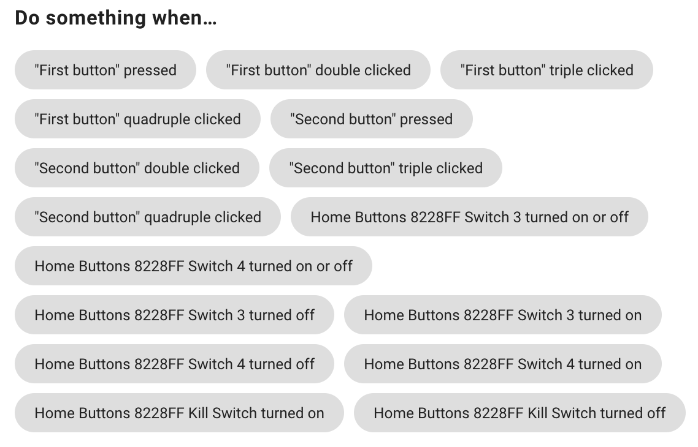

# User guide

## Controlling The Device

- [Settings Menu](#settings) - hold any **two** buttons together for 5 s

## Home Assistant

You can configure most of the settings directly in *Home Assistant*.

> To get to the device's page in *Home Assistant*, click settings in the left side bar, then open *Devices & Services*, move to the *Devices* tab and click on the name you gave your *Home Buttons* during setup.

{width="500"}

### Configure Button Actions

To configure button actions, click "+" on the *Automations* card, select one of the buttons and set up an automation with *Home Assistant*'s editor.

{width="350"}

## Settings Menu {#settings}

Open the *Settings Menu* by holding any two buttons together for 5 seconds. The buttons will start to pulse. You can navigate the menu by pressing the corresponding button:

- :red_circle: red button - [Setup](#setup)
- :orange_circle: orange button - [Wi-Fi Setup](#wifi_setup)
- :blue_circle: blue button - Restart
- :green_circle: green button - Close settings menu

**Factory Reset**

To perform a factory reset, hold the :blue_circle: blue button for 10 seconds. *Home Buttons* will restart and all user settings will be reset to default.
You will have to set up the device again.

## Setup {#setup}

Setup allows you to change connection settings and other configuration options. *Home Buttons* establishes a web interface accessible within the network it is already connected to.

Enter setup by going to the [*Settings Menu*](#settings) and pressing the :red_circle: red button. 

The :red_circle: red button will start to first blink quickly and then pulse.

> It the quick blinking doesn't stop, the device could not connect to the network. Please check the Wi-Fi settings.

Navigate to the setup page via the web browser at `http://HB-XXXXXX.local`. Please see the label on the device for the exact address.

{width="250"}

### Change Wi-Fi settings

Click `Configure WiFi` to change Wi-Fi connection settings. Select a network, enter the password and click save. Wait a few seconds and then press any button to exit setup. *Home Buttons* will connect to the newly selected Wi-Fi network.

### Change MQTT settings & Button labels

Click `Setup` to change MQTT settings or button labels. A page with the following parameters will open:

- `Device Name` - Name of your device as it will appear in *Home Assistant*.

- `MQTT Server` - IP address of your MQTT broker. Usually the same as IP of your *Home Assistant* server.

- `MQTT Port` - Port used by MQTT broker. The default is usually *1883*.

- `MQTT User` - MQTT user name (can be empty if not required by broker).

- `MQTT Password` - MQTT password (can be empty if not required by broker).

- `Base Topic` - MQTT topic that will be prepended to all topics used by *Home Buttons*. The default is `homebuttons`.

- `Discovery Prefix` - *Home Assistant* parameter for MQTT discovery. The default is `homeassistant`.
Leave that unchanged if you haven't modified *Home Assistant*'s configuration.

- `Static IP` - Optional. IP of *Home Buttons*. Must be outside the DHCP address range of your router.

- `Gateway` - Optional. The IP address of your router.

- `Subnet Mask` Optional. Usually `255.255.255.0.`

- `Primary DNS Server` - If left empty, `Gateway` IP will be used.

- `Secondary DNS Server` - If left empty, `1.1.1.1` will be used.

- `Button Config` - A string of 4 characters that represent the mode of each button. The default is `BBBB`. The characters represent buttons 1-4. You can select between a button (trigger) `B` or a switch (toggle) `S`.

When done, click `Save`. The :red_circle: red button will blink 2 times, indicating that the setup was successful.

> If MQTT connection is not successful, the :red_circle: red button will blink 5 times. You can start the setup again by entering the settings menu and pressing the :red_circle: red button.

## Wi-Fi Setup {#wifi_setup}

If *Home Buttons* becomes inaccessible on the local network due to changed Wi-Fi settings, you can restart the Wi-Fi setup at any time.

Open [*Settings Menu*](#settings) by holding any two buttons together for 5 s and press :orange_circle:. Wi-Fi hotspot will be established.

1. *Home Buttons* establishes a Wi-Fi hotspot for configuration.
Connect to the network named `HB-XXXXXX` with your device. The password is `password123`.

2. After connecting to the Wi-Fi network with your device, a **captive portal** will pop up automatically.
If it doesn't, open the web browser and navigate to http://192.168.4.1.

    {width="200"}

3. Click on `Configure WiFi` and wait a few seconds for a list of networks to appear.

4. Select your network, enter the password and click `Save`.

*Home Buttons* will disable the hotspot and connect to your selected Wi-Fi network in a few seconds. The :orange_circle: orange button will blink 2 times.

> If the :orange_circle: orange button doesn't stop pulsing, the connection was not successful. Please check the password and try again. Press any button to stop the Wi-Fi setup. To repeat the Wi-Fi setup, enter the settings menu and press the :orange_circle: orange button.

## Opening The Case {#opening_case}

Unscrew 4 screws holding the front panel of the device. Carefully remove the front panel. Be careful not to strain the button wires.

{width="300"}
