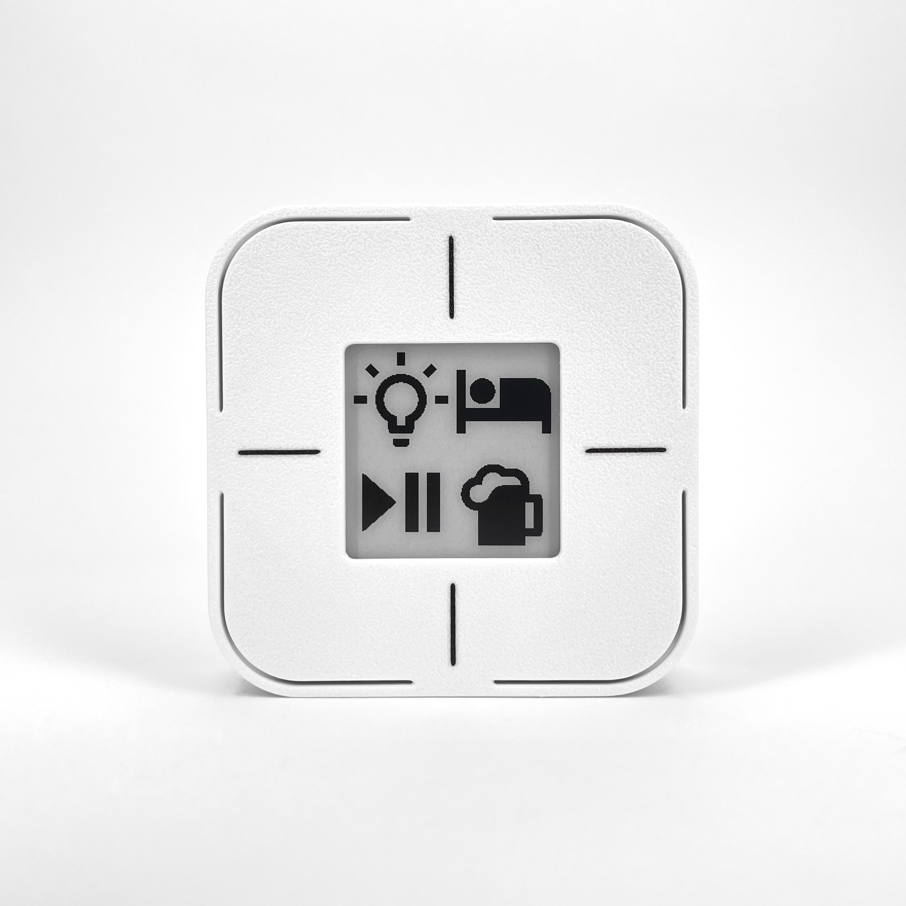

# Home Buttons Mini

{width="350"} 

**Features:**

- 4 push buttons, multiple press support
- 1.5" e-paper display
- *Material Design Icons* :material-emoticon-cool-outline:
- Wi-Fi connectivity
- Less than 1 second from button press to triggered action (depending on your network)
- Temperature & humidity sensor
- 2x AA batteries
- 1-2 year battery life
- Compact size: 64 x 64 x 20 mm

---

## Getting Started

Set up you device with the help of [Getting Started](setup.md) guide.

---

## License

- The software is **open source** and licensed under the GNU GPLv3.  
- The hardware is **open source** and licensed under the CERN-OHL-S-2.0.

---

## Technical Specifications

### Physical

{width="500"}

* Width: 63.6 mm
* Height: 63.6 mm
* Depth: 20.0 mm
* Weight: XX g (incl. batteries)
* Casing material: PETG (3D printed)

### User Interface

* E-paper display
* Four tactile buttons with LED illumination

### Display

* Type: Single color E-paper (non-illuminated)
* Size: 1.5"
* Resolution: 200 x 200
* Model number: Good Display GDEY0154D67

### Connectivity

* 2.4Ghz WiFi
    * MQTT protocol *(Supports MQTT Discovery)*

### SoC

* ESP32-S2
    * Xtensa® Single­Core 32­bit LX7
    * Integrated WiFi modem: IEEE 802.11 b/g/n (2.4 GHz Wi­Fi)
* Supports OTA (Over-The-Air firmware update)
* Advanced security features

### Environmental Sensor

* Sensirion SHTC3 high accuracy Temperature and Relative Humidity sensor
* Temperature accuracy: ±0.2°C *(0°C to 60°C)*
* Humidity accuracy: ±2% RH *(20% RH to 80% RH)*

### Batteries

Home Buttons mini uses two AA alkaline batteries. They prove to be a good compromise between capacity, size, price and availability. A pair should last you about **two years** for the following use case:
* Varta Industrial Pro AA
* 30 minutes sensor interval (for temperature / humidity reporting)
* 20 button presses per day
* WPA-2 Wi-Fi security

Battery life might be shorter if you use Home Buttons more often or if you use WPA-3 WiFi security. It can be extended by increasing the sensor interval (you can do that from *Home Assistant* or the setup page) or setting up static IP.

> Always use high quality alkaline batteries from a reputable brand. During WiFi communication, the device needs large bursts of power, which low-quality batteries might not be able to provide, decreasing your battery life drastically.
