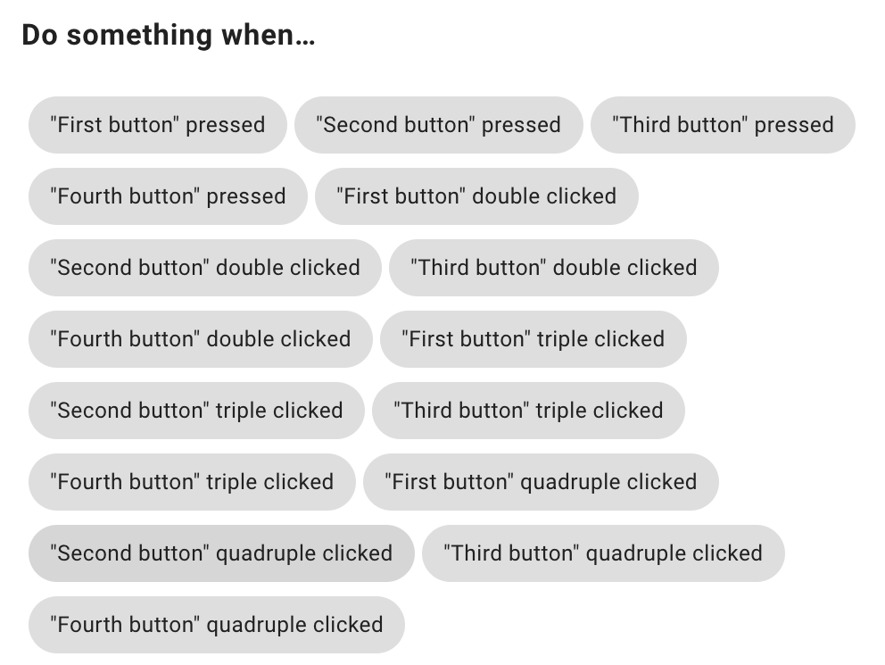
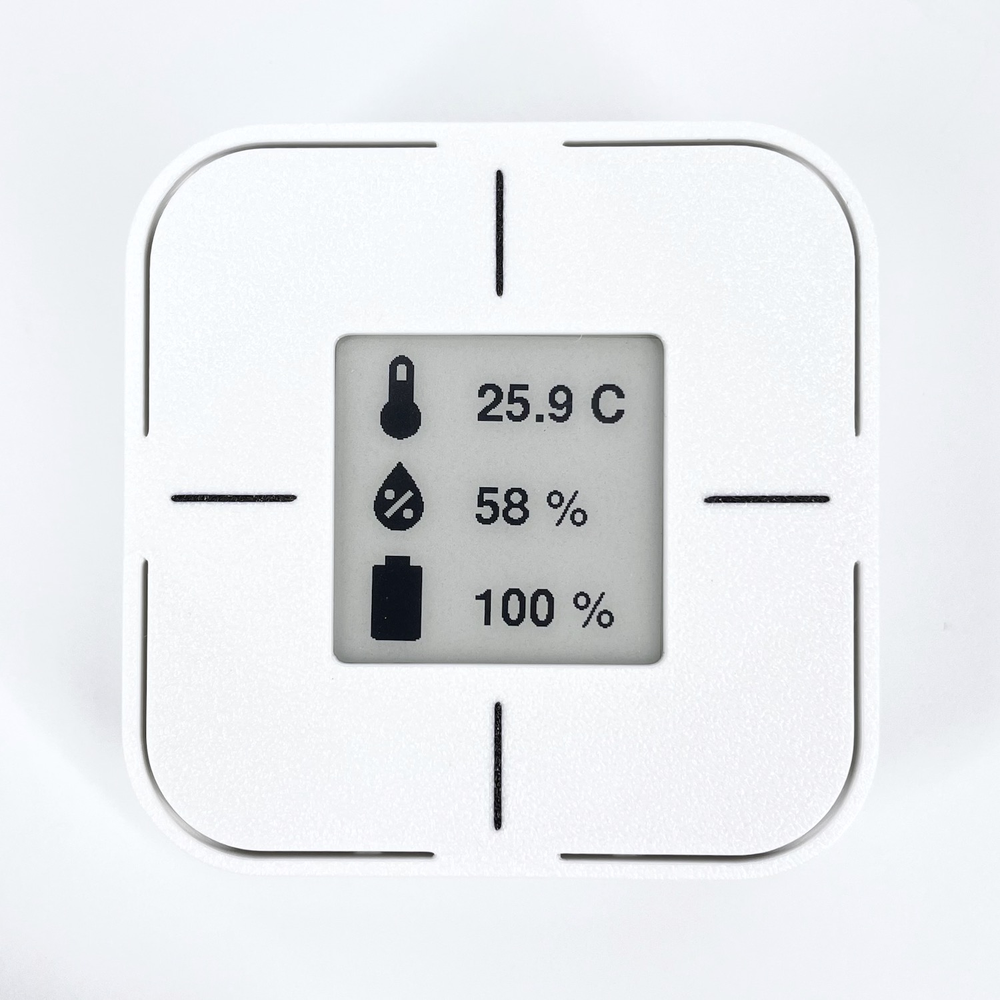
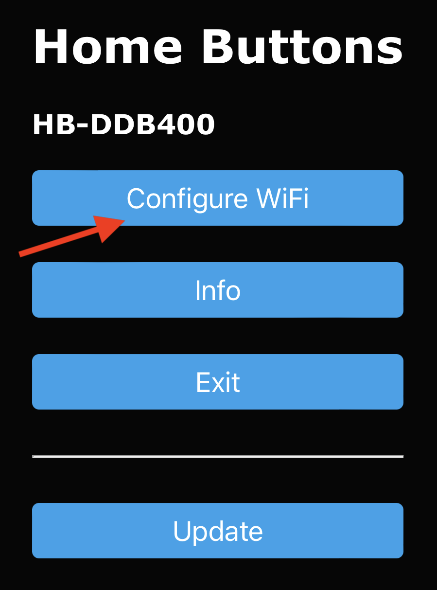

# User guide


## Controlling The Device

- [Info Screen](#info_screen) - hold any button for 2 s
- [Settings Menu](#settings) - hold any **two** buttons together for 5 s

Firmware v2.2.1 and below:
- [Info Screen](#info_screen) - hold any button for 2 s
- [Settings Menu](#settings) - hold any button for 5 s

## Home Assistant
 
You can configure most of the settings directly in *Home Assistant*.

> To get to the device's page in *Home Assistant*, click settings in the left side bar, then open *Devices & Services*, move to the *Devices* tab and click on the name you gave your *Home Buttons* during setup.

{width="500"}

### Configure Button Icons :material-home:

In the *Controls* card, enter the name of the icon, that you want to be shown on the e-paper display. Icons will be updated next time you press a button or on the next sensor update interval.


You can choose any of the [*Material Design Icons*](https://materialdesignicons.com/){:target="_blank"}. Enter the icon name in the label field in the format `mdi:{icon name}`. For example, `mdi:lightbulb-auto-outline`.

Icons are downloaded from a *Github* repository. For that purpose an internet connection is required. Once downloaded, the icons are stored permanently on the device. If you do not wish to have *Home Buttons* connected to the internet, you can set up the icons once and then disable internet access.

### Configure Button Actions

To configure button actions, click "+" on the *Automations* card, select one of the buttons and set up an automation with *Home Assistant*'s editor.

{width="350"}

> The expected delay from a button being pressed to the automation being triggered is around 1 second (depending on your network).

### Configure Button Actions

To configure button actions, click "+" on the *Automations* card, select one of the buttons and set up an automation with *Home Assistant*'s editor.

{width="350"}

> The expected delay from a button being pressed to the automation being triggered is around 1 second (depending on your network).

### Configure Sensor Publish Interval {#sensor_interval}

The device uses deep sleep to preserve battery. It wakes up every few minutes to measure temperature and humidity and publish the data to MQTT topics. You can set the publishing interval with a slider on the *Controls* card.
The range is from 5 to 60 minutes. The default is 30 minutes.

> Be aware, that this setting greatly impacts the battery life. The advertised battery life of 1-2 years is achievable with the interval set to 30 minutes (the default) or greater.

## Settings Menu {#settings}

Open the *Settings Menu* by holding any two buttons together for 5 seconds. The menu will show the following options:

- :material-account-cog: - [Setup](#setup)
- :material-wifi-cog: - [Wi-Fi Setup](#wifi_setup)
- :material-restore: - Restart
- :material-close: - Close settings menu

> Restart triggers publishing MQTT discovery message and icon download. The first time after a restart, Wi-Fi connection
will take a few seconds longer.

**Device Info**

You can see details of you device like software version, hardware revision and IP address in the *Device Info* menu. To access it, hold :material-account-cog: for 2 seconds.

**Factory Reset**

To perform a factory reset, hold :material-restore: for 10 seconds. *Home Buttons* will restart and all user settings will be reset to default.
You will have to set up the device again.


## Info Screen {#info_screen}

Info screen displays current **temperature**, **humidity** and **battery** percentage.

{width="250"}

Bring it up by pressing any button for 2 seconds. *Home Buttons* will automatically revert to showing button labels after 30 seconds. Or do that manually by pressing any button again.

## Setup {#setup}

Setup allows you to change connection settings and button labels. *Home Buttons* establishes a web interface accessible within the network it is already connected to.

Begin setup by going to [*Settings Menu*](#settings) and pressing :material-account-cog:. *Home Buttons* will display instructions for connecting to a web interface. Scan the QR code or enter the local IP into a web browser.

{width="250"}

### Change Wi-Fi settings

Click `Configure WiFi` to change Wi-Fi connection settings. Select a network, enter the password and click save. Wait a few seconds and then press any button to exit setup. *Home Buttons* will connect to the newly selected Wi-Fi network.

### Change MQTT settings & Button labels

Click `Setup` to change MQTT settings or button labels. A page with the following parameters will open:

- `Device Name` - Name of your device as it will appear in *Home Assistant*.

- `MQTT Server` - IP address of your MQTT broker. Usually the same as IP of your *Home Assistant* server.

- `MQTT Port` - Port used by MQTT broker. The default is usually *1883*.

- `MQTT User` - MQTT user name (can be empty if not required by broker).

- `MQTT Password` - MQTT password (can be empty if not required by broker).

- `Base Topic` - MQTT topic that will be prepended to all topics used by *Home Buttons*. The default is `homebuttons`.

- `Discovery Prefix` - *Home Assistant* parameter for MQTT discovery. The default is `homeassistant`.
Leave that unchanged if you haven't modified *Home Assistant*'s configuration.

- `Static IP` - Optional. IP of *Home Buttons*. Must be outside the DHCP address range of your router.

- `Gateway` - Optional. The IP address of your router.

- `Subnet Mask` Optional. Usually `255.255.255.0.`

- `Primary DNS Server` - If left empty, `Gateway` IP will be used.

- `Secondary DNS Server` - If left empty, `1.1.1.1` will be used.

- `Button {1-4} Label` - Label that will be displayed next to each button.

- `Temperature Unit` - Either `C` - Celsius  or `F` - Fahrenheit.

When done, click `Save`. Device will exit the setup and display button labels.

> If MQTT connection is not successful, `MQTT error` will be displayed and *Home Buttons* will return to welcome screen.
You can start the setup again by pressing any button. Please make sure to enter correct MQTT parameters.

## Wi-Fi Setup {#wifi_setup}

If *Home Buttons* becomes inaccessible on the local network due to changed Wi-Fi settings, you can restart the Wi-Fi setup at any time.

Open [*Settings Menu*](#settings) by holding any two buttons together for 5 s and press :material-wifi-cog:. Wi-Fi hotspot will be established and connection instructions will be displayed.

1. *Home Buttons* will establish a Wi-Fi hotspot.
Connect to it by scanning the QR code on the display or manually connecting to Wi-Fi network and entering the password.

    {width="250"}

    > The Wi-Fi password is `password123`.

2. After connecting to *Home Buttons* Wi-Fi with your device, a **captive portal** will pop up automatically.
If it doesn't, open the web browser and navigate to any web page. You will be redirected to the captive portal.

    {width="200"}

3. Click `Configure WiFi` and wait a few seconds for a list of networks to appear.

4. Select your network, enter the password and click `Save`.

*Home Buttons* will disable the hotspot and connect to your Wi-Fi network in a few seconds. `Wi-Fi CONNECTED` will appear on display.

> If connection is not successful, `Wi-Fi error` will be displayed and *Home Buttons* will return to welcome screen.
You can start Wi-Fi setup again by pressing any button. Please make sure to enter the password correctly.

## Display a Custom Message {#custom_message}

A custom message can be shown on the e-paper display by inputting it in the `Show Message` field on the device page in *Home Assistant*.

You can also use the `Show Message` entity in automations:

```yaml
action:
  - device_id: 966128a1b5d43dd1b22424cd0a77d44c
    domain: text
    entity_id: text.home_buttons_265cbf_show_message
    type: set_value
    value: "Test \n Message"
```

Message will not be wrapped automatically. You must include line breaks `\n` manually.

Alternatively, you can display a message by publishing a retained payload to the `{base_topic}/{device_name}/cmd/disp_msg` topic. The message will be displayed when the device wakes up on button press or sensor publish. You can clear the message by pressing any button.

Example *Home Assistant* publish service call YAML:

```yaml
service: mqtt.publish
data:
  topic: homebuttons/HB Mini 123/cmd/disp_msg
  payload: "Line 1\nLine 2"
  retain: true
```

`mosquitto_pub` example:

```bash
mosquitto_pub -h <broker_host> -t <topic> -m $'Line 1\nLine 2'
```

## Schedule Wakeup

You can schedule the next wakeup using the `Schedule Wakeup` entity. This is useful if you are changing labels dynamically based on state of other devices.

For example: If some action you trigger with a button press is not instant, but takes some time to complete, you can schedule the next wakeup after the action is completed. This way the label will be updated sooner, instead of having to wait for the next sensor publish wakeup.

Example *Home Assistant* automation YAML:

```yaml
alias: schedule test
description: ""
mode: single

# Change button label immediately on press
trigger:
  - platform: device
    domain: mqtt
    device_id: 966128a1b5d43dd1b22424cd0a77d44c
    type: button_short_press
    subtype: button_3
    discovery_id: HBTNS-2301-001-265CBF button_3
condition: []
action:
  - device_id: 966128a1b5d43dd1b22424cd0a77d44c
    domain: text
    entity_id: text.home_buttons_265cbf_button_3_label
    type: set_value
    value: _OPENING...

# Schedule next wakeup after 15 seconds
  - device_id: 966128a1b5d43dd1b22424cd0a77d44c
    domain: number
    entity_id: number.home_buttons_265cbf_schedule_wakeup
    type: set_value
    value: 15

# Simulate some action that takes 10 seconds
  - delay:
      hours: 0
      minutes: 0
      seconds: 10
      milliseconds: 0

# Change button label after action is completed
  - device_id: 966128a1b5d43dd1b22424cd0a77d44c
    domain: text
    entity_id: text.home_buttons_265cbf_button_3_label
    type: set_value
    value: _OPENED
```

You can also schedule wakeup by publishing a message to the `{base_topic}/{device_name}/cmd/schedule_wakeup` topic. The message payload should be the number of seconds to wait before the next wakeup. The minimum value is 5 seconds.

## Opening The Case {#opening_case}

If you need to remove or replace the battery, or perform a manual firmware upgrade, you have to open the case. The back cover can stay mounted to the wall during the procedure.

1. Open the back cover by pressing the tab on the bottom of the device.

3. Replace the back cover by aligning it first at the top and then pressing it down until it clicks.

{width="300"}
