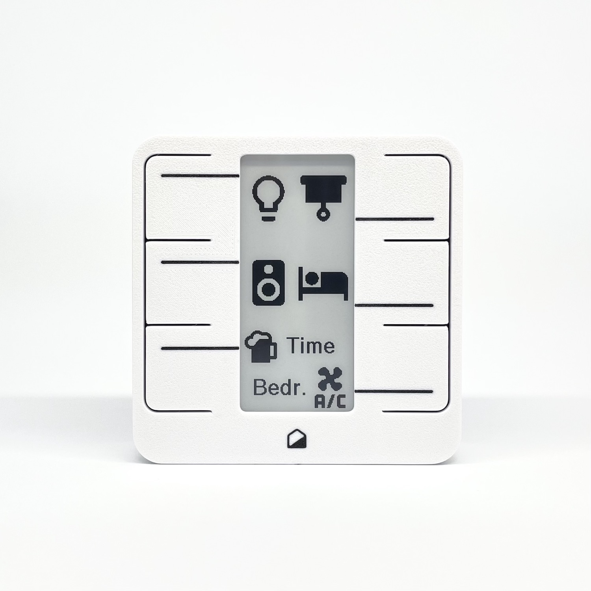
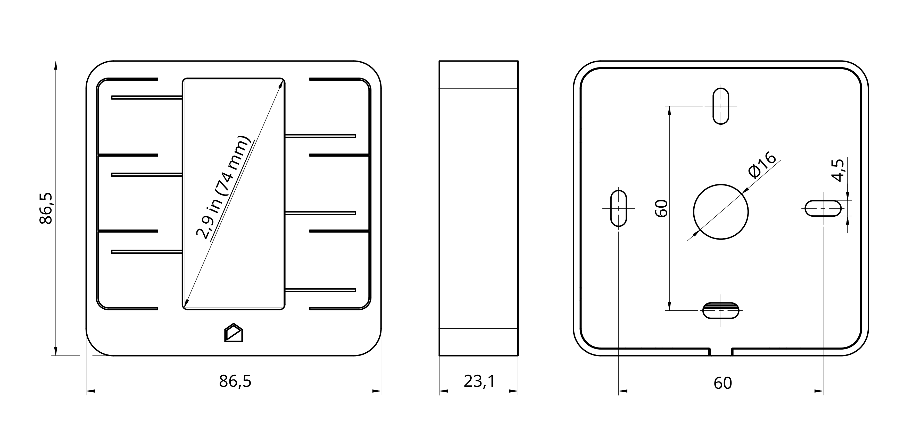

# Home Buttons

{width="350"} 

**Features:**

- 6 push buttons, multiple press support
- 2.9" e-paper display
- Text labels and *Material Design Icons* :material-emoticon-cool-outline:
- Wi-Fi connectivity
- Less than 1 second from button press to triggered action (depending on your network)
- Temperature & humidity sensor
- Power options: 18650 Li-Ion Battery Cell, USB-C, 5V DC
- Greater than 1 year battery life
- USB-C charging
- Compact size: 87 x 87 x 23 mm

---

## Getting Started

Set up you device with the help of [Getting Started](setup.md) guide.

---

## Where To Get

You can buy *Home Buttons* on [*Tindie*](https://www.tindie.com/products/plab/home-buttons/?ref=offsite_badges&utm_source=sellers_nplan&utm_medium=badges&utm_campaign=badge_medium){:target="_blank"} or
[*Lectronz*](https://www.lectronz.com/products/home-buttons-smart-home-controller).

---

## Technical Specifications

### Physical

{width="500"}

* Width: 86.5 mm
* Height: 86.5 mm
* Depth: 22.8 mm
* Weight: 140 g (incl. battery)
* Casing material: PETG (3D printed)

### User Interface

* E-paper display
* 6 tactile buttons with LED illumination

### Display

* Type: Single color E-paper (non-illuminated)
* Size: 2.9"
* Resolution: 296 x 128
* Model number: Good Display GDEY029T94

### Connectivity

* 2.4Ghz WiFi
    * MQTT protocol *(Supports MQTT Discovery)*
* USB Type-C connector
    * Charging
    * Firmware update *(USB DFU mode)*
    * Debug messages *(USB CDC mode)*

### SoC

* ESP32-S2
    * Xtensa® Single­Core 32­bit LX7
    * Integrated WiFi modem: IEEE 802.11 b/g/n (2.4 GHz Wi­Fi)
* Supports OTA (Over-The-Air firmware update)
* Native USB for firmware update and debug
* Advanced security features

### Environmental Sensor

* Sensirion SHTC3 high accuracy Temperature and Relative Humidity sensor
* Temperature accuracy: ±0.2°C *(0°C to 60°C)*
* Humidity accuracy: ±2% RH *(20% RH to 80% RH)*

### Battery

* **3.7 V Lithium-Ion 18650** battery cell (non-protected) is required
* ***WARNING:*** maximum cell length is 65.5 mm. Button top cells might not fit properly
* Expected battery life: **18 months**
    * *Assuming Panasonic NCR18650B 3400mAh or equivalent*
* Battery safety features:
    * Reverse polarity protection
    * Over-discharge protection
    * Over-charge protection
    * Overload protection

> Charging at extreme temperatures (below 0°C or above 50°C) is not recommended. Check your battery specifications for more information

### Charging

* Any standard USB Type-C power supply is sufficient for charging
> Can also be charged using any computer USB port
* Battery charging current: **780 mA**
> Make sure the selected battery can be safely charged at this rate
* Expected recharging time from empty: **4 hours**
> Assuming Panasonic NCR18650B 3400  mAh or equivalent