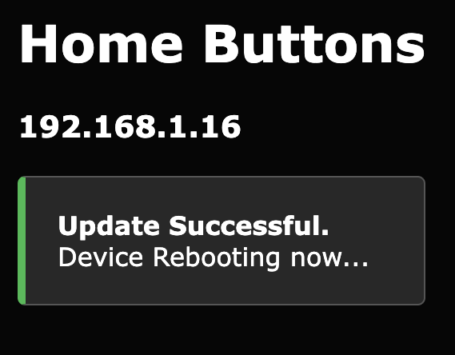

# Firmware Update

You can see the current firmware version in *Home Assistant*. 
Find your *Home Buttons* in the device list and click it. Firmware version is displayed in the *Device info* card.

{width="250"}

Firmware can be updated in two ways:

- [Over The Air](#OTA) (OTA) using a web interface - ***recommended***
- [Flashing via USB](#USB)

> OTA is the simplest way and therefore recommended. Flash via USB only if something goes wrong with the OTA update and web interface is not accessible.

**Important!** Downgrading from v2.0.4 to an earlier version is not supported!

## Over The Air (OTA) {#OTA}

1. Find the latest firmware *.bin* file [here](https://github.com/nplan/HomeButtons/releases){:target="_blank"} and download it to your computer.

2. Enter *Setup* from the [*Settings Menu*](#settings). Home Buttons will display instructions for connecting to a web interface.
Scan the QR code or enter the local IP into a web browser.

    {width="250"}

3. Click `Info` and scroll to the bottom of the *Info* screen. Click `Update`. The update menu will load:

    {width="250"}

4. Click `Choose file` and select the previously downloaded *.bin* file on your computer.

5. Click `Update` Wait a few seconds while the firmware is downloaded to the device. When done, `Update Successful` message will appear in your web browser and *Home Buttons* will reboot.

    {width="200"}
 
## Flashing via USB {#USB}

1. Install ***esptool***. If you already have *Python* installed, the easiest way is to install it using *pip*: 

    ```
    pip install esptool
    ```

    > See [here](https://docs.espressif.com/projects/esptool/en/latest/esp32/installation.html){:target="_blank"}
    for more installation details.

2. Find the latest firmware *.bin* file [here](https://github.com/nplan/HomeButtons/releases){:target="_blank"} and download it to your computer.

3. Open the case. See instructions [here](user_guide.md#opening_case){:target="_blank"}.

4. Place device into **programming mode**. Press and hold the `BOOT` button and then press the `RST` button.
`BOOT LED` will light up. Release both buttons.

    {width="350"}

5. Connect *Home Buttons* to your computer using an USB-C cable.

6. Determine port on you computer.

    ***Windows***
    
    Open *Device Manager* and check *Ports* section. 
    If you're not sure which device is *Home Buttons*, disconnect it and then reconnect it. 
    See which port disappears and then appears again. Remember the *COM##* name.

    ** *macOS* and *Linux* **

    Run the following command twice. First with *Home Buttons* connected and then disconnected.
    The port that is present the first time and not the second is the correct one.

    *macOS*

    ``` { .yaml .copy }
    ls /dev/cu*
    ```    

    *Linux*

    ``` { .yaml .copy }
    ls /dev/tty*
    ```

    Copy the path of the correct port.
 
7. Flash the firmware using *esptool*. Run this two commands in *Terminal* or *Command Prompt*:

    ``` { .yaml .copy }
    python -m esptool --port PORT --after no_reset erase_region 0xe000 0x2000
    ```
    ``` { .yaml .copy }
    python -m esptool --port PORT --after no_reset write_flash 0x10000 BIN_FILE_PATH
    ```

    Substitute `PORT` with port that you determined in previous step.
    Substitute `BIN_FILE_PATH` with the path of downloaded firmware *.bin* file.

    > The `erase_region` command resets the app partition boot switch. It's required to make sure the device will boot to the newly flashed firmware.

8. Wait a few seconds for firmware to flash. When done, you will see a confirmation in *Terminal* or *Command Prompt* window.

9. Disconnect USB-C cable and press the `RST` button.
*Home Buttons* will display `RESTART...` and then return to showing button labels. Firmware is now successfully updated.

