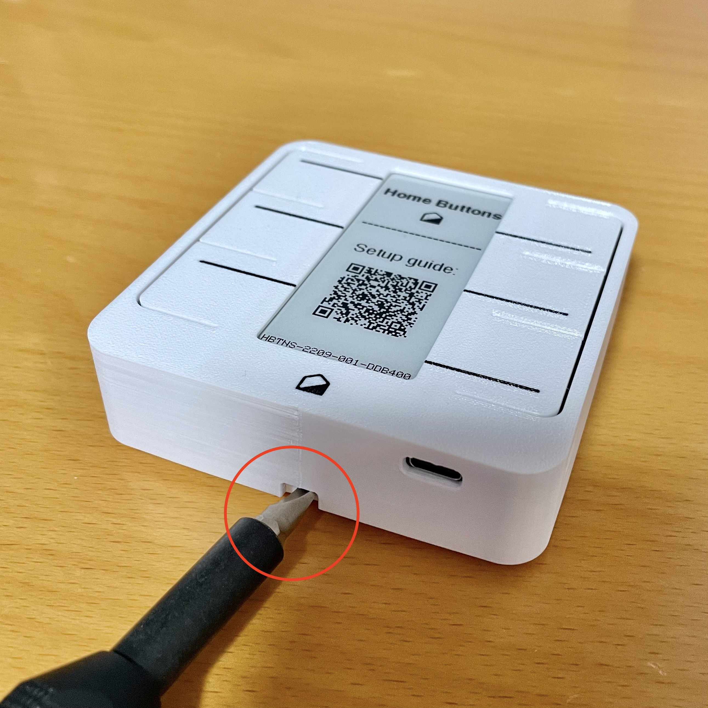
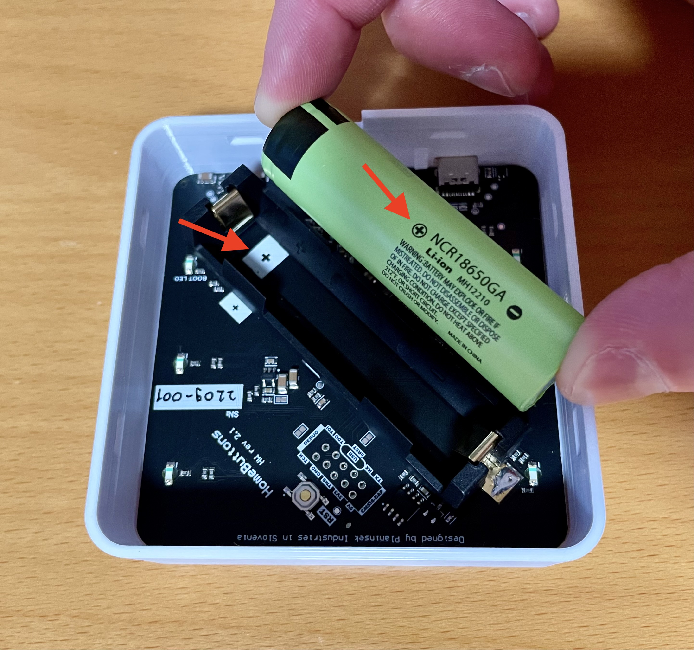
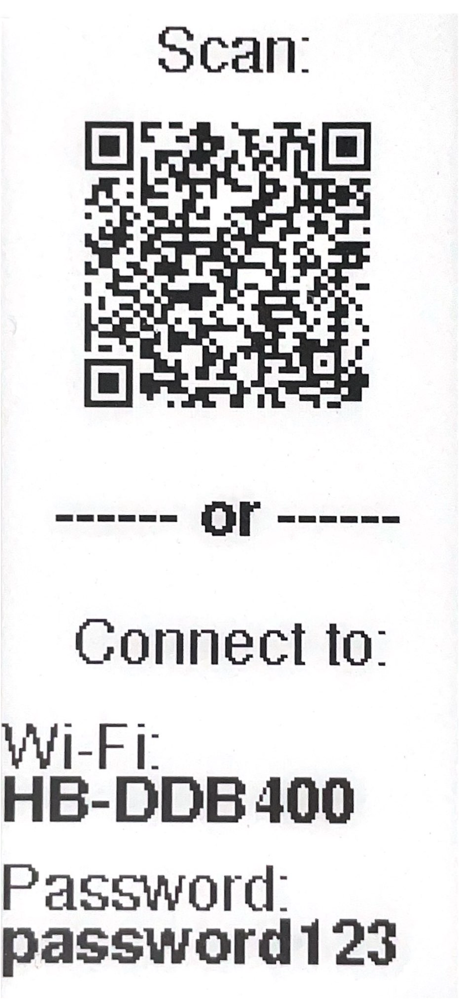
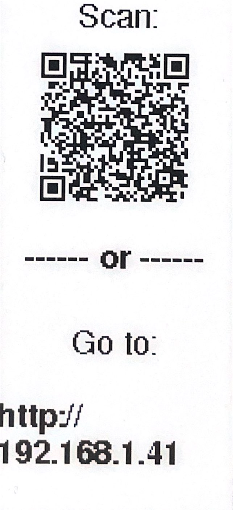
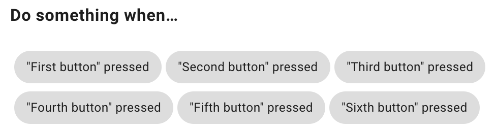
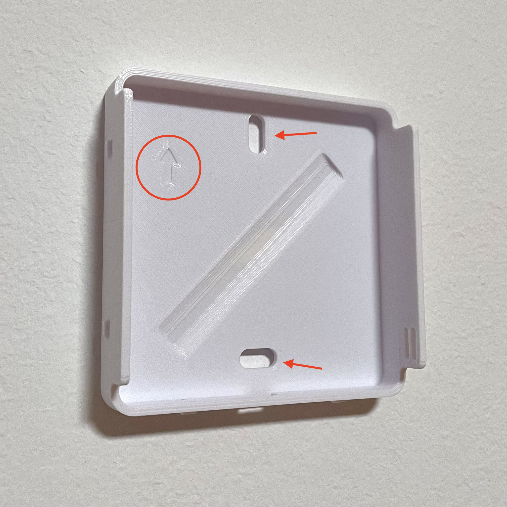
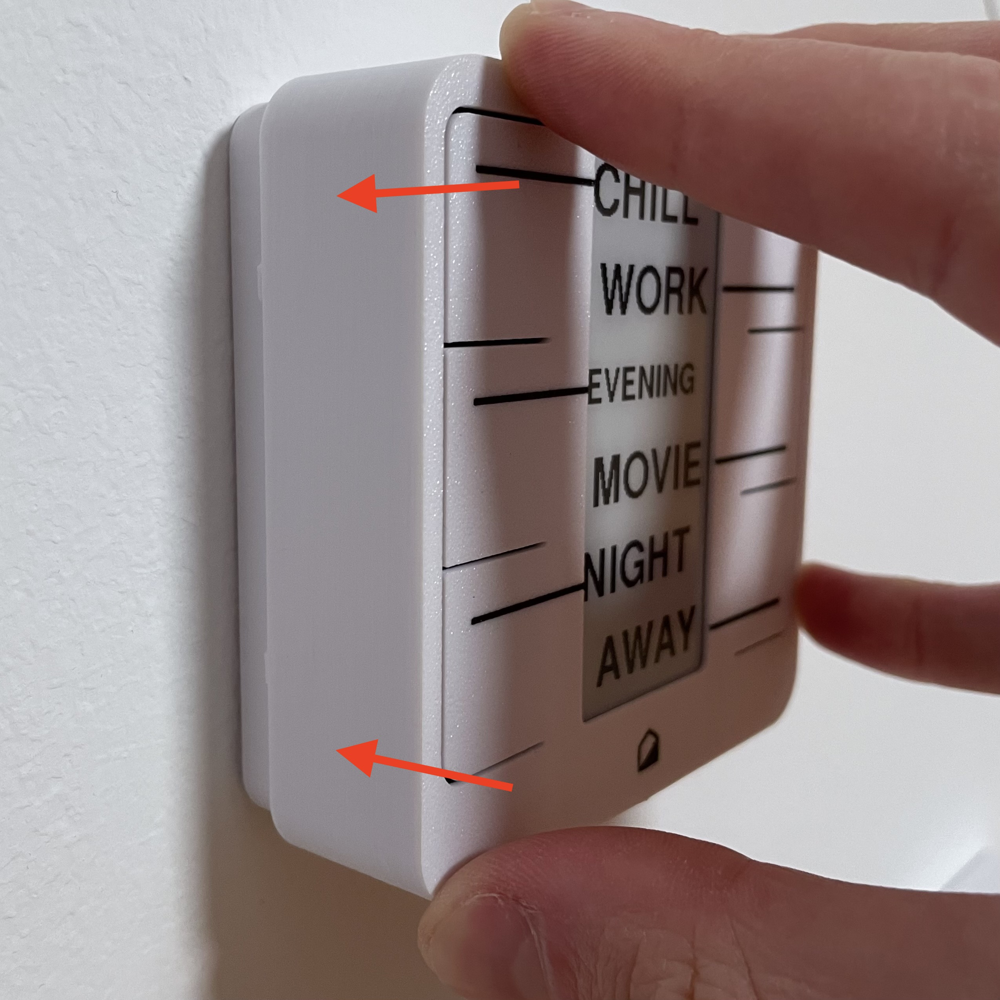

# Quick Setup

**Setup up your *Home Buttons* in a few simple steps!**

You will need:

- One 18650 Li-Ion battery cell (not included)
- A flat headed screwdriver
- 2x mounting screws with anchors suitable for your walls ***or*** double sided tape (must stick to plastic well)
- A Wi-Fi network
- An MQTT broker
- *Home Assistant* (optional - can work only through MQTT)

## Insert The Battery

You will need one 18650 Li-Ion battery cell (**not included**). Please use a 
high quality cell with greater than 3000 mAh capacity.

1. Detach the back cover by inserting a flat headed screwdriver in the hole at the bottom and twisting it. Then pull it off.

    {width="300"}

2. Insert the battery cell. Be careful to orient it so that polarity matches markings on the PCB.

    {width="300"}

3. Keep the back cover off for now. You will install it when mounting *Home Buttons* to the wall.

## Set Up Wi-Fi Connection

After inserting the battery, press any button to wake the device and start Wi-Fi setup procedure.

> If the device doesn't wake when pressing a button, please briefly connect it to an USB-C charger

> If you don't complete the setup in 10 minutes, *Home Buttons* will turn off again to save battery.
Press any button to wake the device and start again.

1. *Home Buttons* establishes a Wi-Fi hotspot for configuration.
Connect to it by scanning the QR code on the display or manually connecting to Wi-Fi network and entering the password.

    {width="125"}

2. After connecting to *Home Buttons* Wi-Fi with your device, a **captive portal** will pop up automatically.
If it doesn't, open the web browser and navigate to any web page. You will be redirected to the captive portal.

    {width="200"}

3. Click on `Configure WiFi` and wait a few seconds for a list of networks to appear.

4. Select your network, enter the password and click `Save`.

*Home Buttons* will disable the hotspot and connect to your Wi-Fi network in a few seconds. `Wi-Fi CONNECTED` will appear on display.

> If connection is not successful, `Wi-Fi error` will be displayed and *Home Buttons* will return to welcome screen.
You can start Wi-Fi setup again by pressing any button. Please make sure to enter the password correctly.

## Set Up MQTT Broker

*Home Buttons* requires an MQTT broker. If you don't already use it, you should install one now.
See this [page](https://www.home-assistant.io/integrations/mqtt/){:target="_blank"} for more information.
Usually, the simplest way is to install *Mosquitto MQTT* as a *Home Assistant* add-on.
## Set Up MQTT connection & Button Labels

When connected to your Wi-Fi network, *Home Buttons* can be configured using any device on your local network.

1. Scan the QR code or enter the local IP into a web browser. The setup page will load:

    {width="125"} 
    {width="250"}

2. Click `Setup`

3. Enter the connection parameters:

    - `Device Name` - Name of your device as it will appear in *Home Assistant*.

    - `MQTT Server` - IP address of your MQTT broker. Usually the same as IP of your *Home Assistant* server.

    - `MQTT Port` - Port used by MQTT broker. The default is usually *1883*.

    - `MQTT User` - MQTT user name (can be empty if not required by broker).

    - `MQTT Password` - MQTT password (can be empty if not required by broker).

    - `Base Topic` - MQTT topic that will be prepended to all topics used by *Home Buttons*. The default is `homebuttons`.

    - `Discovery Prefix` - *Home Assistant* parameter for MQTT discovery. The default is `homeassistant`.
    Leave that unchanged if you haven't modified *Home Assistant*'s configuration.

4. Enter button labels

    - `Button 1 Label` - `Button 6 Label` - Label that will be displayed next to each button. The order is from top to bottom.

    > *Home Buttons* will choose font size automatically. It can display around **5** letters in large font and around **7** letters in smaller font.
    Labels over **7** letters will be clipped. Choose what you want to display wisely :)
    
5. Confirm by clicking `Save`. Device will exit the setup and display button labels.

> If MQTT connection is not successful, `MQTT error` will be displayed and *Home Buttons* will return to welcome screen.
You can start the setup again by pressing any button. Please make sure to enter correct MQTT parameters.

## Set Up Home Assistant

*Home Buttons* uses *MQTT Discovery* and will appear in *Home Assistant*'s device list automatically.
There you can see device information, sensor readings, battery state and set up button actions.

{width="300"}

To set up button actions, click "+" on *Automations* card, select one of the buttons and set up an automation with *Home Assistant*'s editor.

{width="350"}

## Mount To The Wall

{width="300"}

Mount the **back cover** of *Home Buttons* to the wall. There are 2 options:

1. **Screws**

    Use two screws (max diameter 4.5 mm) with anchors suitable for your walls (not included).

2. **Tape**

    Use double sided tape (not included). Use only high quality heavy duty foam mounting tape.
    A small patch of size around 1 x 1 cm in each corner works best.

Either way, **make sure the arrow is pointing upwards!**

When the back cover is securely mounted, you can clip on the front of the device. Push it firmly until it's flush with the wall.

{width="300"}

***DONE!***

## Other Important Information

### Charging

The expected battery life is > 1.5 years with a high quality 18650 cell.
When the battery is getting low, *Home Buttons* will remind you to charge after pressing a button.
If the battery gets critically low, the device will turn off.
The display will show: `TURNED OFF PLEASE RECHARGE BATTERY`. You can see the remaining batter percentage as a sensor in *Home Assistant*.

Plug in any USB-C charger to charge the battery. The expected full charge time is 4 hours.
There is no state of charge indication during charging. When the battery is fully charged, the display will show `FULLY CHARGED`.

### Temperature & Humidity

*Home Buttons* includes a high precision temperature and humidity sensor. The readings are taken every 10 minutes and on every button press.
The values are displayed as sensors in *Home Assistant*. 

> You can bring up a display of current temperature, humidity & battery charge percentage by pressing any button for 2 seconds.
The device will automatically revert to showing button labels in 30 seconds. Or do that manually by pressing any button again.

## What's next?

See [User Guide](user_guide.md) for further information about using and re-configuring the device.
