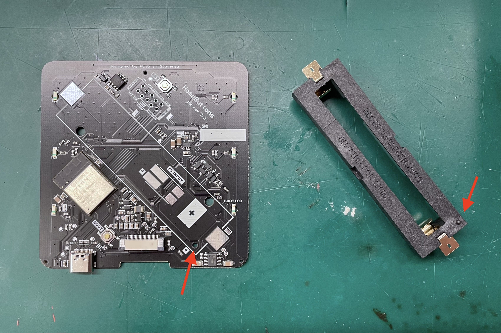
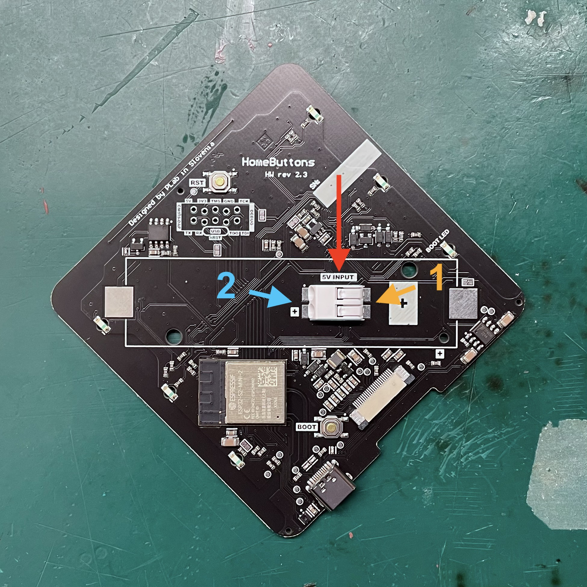

# Soldering

Se instructions below for your chosen power supply option. You can only use **one** option at a time.

## Battery Cell Holder

1. Align the cell holder so that the pin in the corner matches the hole in the PCB.

    {width="600"}

2. Solder the contacts on each side
    
    {width="400"}

    > - Use a powerful soldering iron with a large tip (width of 3-4 mm works best)
    - Approach with the tip from a side that is free of any neighboring components to avoid damaging them
    - Avoid soldering for too long. Excessive heat could damage the e-paper display on the other side of the PCB!
    If you're having trouble making the joint quickly, your soldering iron is probably not powerful enough or you tip is too small.
    - Use enough tin to completely fill the holes in the battery holder contacts. The tin should also flow nicely all around the contact.

## DC Wire Terminal

1. Solder a layer of tin onto the pads of PCB. This makes the next steps easier.

2. Place the terminal connector so that the openings for the wires are pointing towards the middle of the PCB.
The connector should be centered so that there is equal amount of the pads left clear on each side.

    {width="400"}

3. Solder first on the side opposite to the wire openings, where the contacts are more accessible.

4. Solder on the other side. The contacts here are a bit hard to reach. Place the tip on the pad in front of the contacts and let it heat up. 
Add some tin from the side. It should flow towards the contact and make a joint.

5. Visually check the solder joints for any problems

> Avoid soldering for too long. Excessive heat could damage the e-paper display on the other side of the PCB!