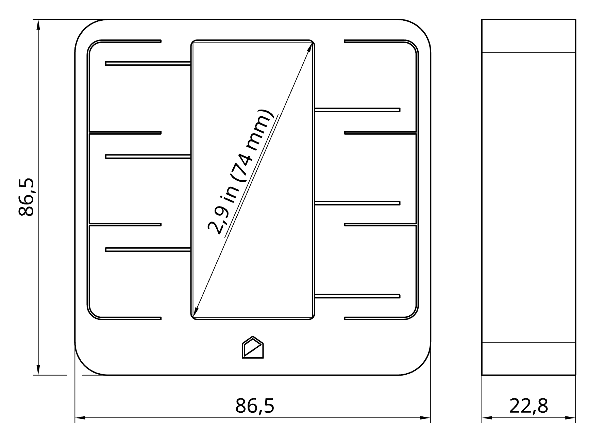

# Technical Specifications

## Physical

{width="400"}

* Width: 86.5 mm
* Height: 86.5 mm
* Depth: 22.8 mm
* Weight: 140 g (incl. battery)
* Casing material: PETG (3D printed)

## User interface

* E-paper display
* Six tactile buttons with LED illumination
* Proximity detection *(coming soon via software update)*

## Display

* Type: Single color E-paper (non-illuminated)
* Size: 2.9"
* Resolution: 296 x 128
* Model number: Good Display GDEY029T94

## Connectivity

* 2.4Ghz WiFi
    * MQTT protocol *(Supports MQTT Discovery)*
* USB Type-C connector
    * Charging
    * Firmware update *(USB DFU mode)*
    * Debug messages *(USB CDC mode)*

## SoC

* ESP32-S2
    * Xtensa® Single­Core 32­bit LX7
    * Integrated WiFi modem: IEEE 802.11 b/g/n (2.4 GHz Wi­Fi)
* Supports OTA (Over-The-Air firmware update)
* Native USB for firmware update and debug
* Advanced security features

## Environmental sensor

* Sensirion SHTC3 high accuracy Temperature and Relative Humidity sensor
* Temperature accuracy: ±0.2°C *(0°C to 60°C)*
* Humidity accuracy: ±2% RH *(20% RH to 80% RH)*

## Battery

* **3.7 V Lithium-Ion 18650** battery cell (non-protected) is required
* Expected battery life: **18 months**
    * *Assuming Panasonic NCR18650B 3400mAh or equivalent*
* Battery safety features:
    * Reverse polarity protection
    * Over-discharge protection
    * Over-charge protection
    * Overload protection

> Charging at extreme temperatures (below 0°C or above 50°C) is not recommended. Check your battery specifications for more information

## Charging

* Any standard USB Type-C power supply is sufficient for charging
> Can also be charged using any computer USB port
* Battery charging current: **780 mA**
> Make sure the selected battery can be safely charged at this rate
* Expected recharging time from empty: **4 hours**
> Assuming Panasonic NCR18650B 3400  mAh or equivalent

