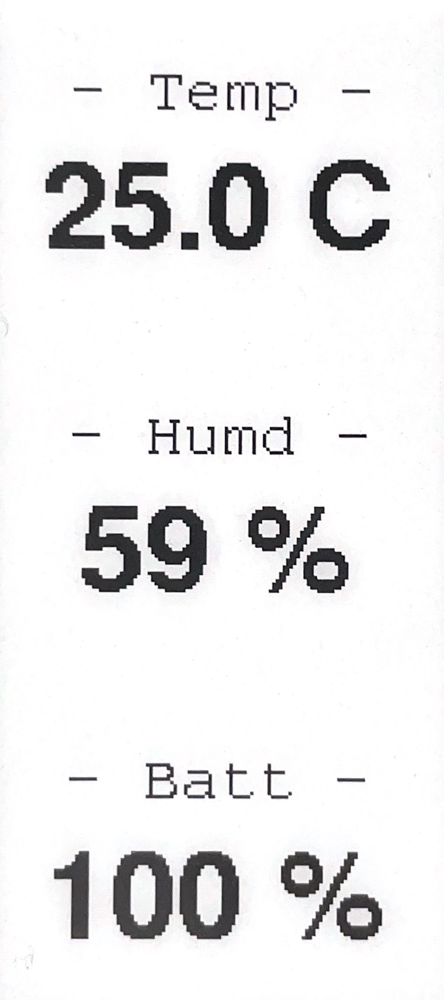
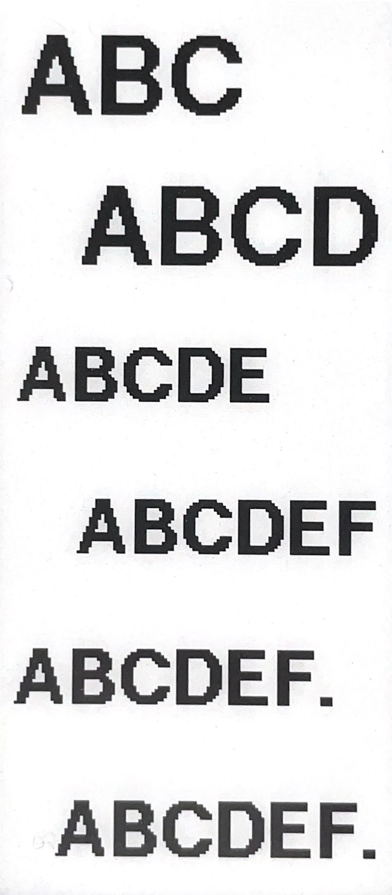

# User guide

## Controlling The Device

Press any button for:

- 2 s - [Info Screen](#info_screen)
- 10 s - [Setup](#setup)
- 20 s - [Wi-Fi Setup](#wifi_setup)
- 30 s - [Factory Reset](#factory_reset)

## Info Screen {#info_screen}

Info screen displays current temperature, humidity and battery charge percentage.

{width="125"}

Bring it up by pressing any button for 2 seconds. *Home Buttons* will automatically revert to showing button labels in 30 seconds. Or do that manually by pressing any button again.

## Setup {#setup}

Setup allows you to change connection settings and button labels. *Home Buttons* establishes a web interface accessible within the network it is already connected to.

Begin setup by pressing any button for 10 seconds. *Home Buttons* will display instructions for connecting to a web interface. Scan the QR code or enter the local IP into a web browser.

{width="125"} 
{width="250"}

### Change Wi-Fi settings

Click `Configure WiFi` to change Wi-Fi connection settings. Select a network, enter the password and click save. Wait a few seconds and then press any button to exit setup. *Home Buttons* will connect to the newly selected Wi-Fi network.

### Change MQTT settings & Button labels

Click `Setup` to change MQTT settings or button labels. A page with the following parameters will open:

- `Device Name` - Name of your device as it will appear in *Home Assistant*.

- `MQTT Server` - IP address of your MQTT broker. Usually the same as IP of your *Home Assistant* server.

- `MQTT Port` - Port used by MQTT broker. The default is usually *1883*.

- `MQTT User` - MQTT user name (can be empty if not required by broker).

- `MQTT Password` - MQTT password (can be empty if not required by broker).

- `Base Topic` - MQTT topic that will be prepended to all topics used by *Home Buttons*. The default is `homebuttons`.

- `Discovery Prefix` - *Home Assistant* parameter for MQTT discovery. The default is `homeassistant`.
Leave that unchanged if you haven't modified *Home Assistant*'s configuration.

- `Button 1 Label` - `Button 6 Label` - Label that will be displayed next to each button. The order is from top to bottom.

> *Home Buttons* will choose font size automatically. It can display around **5** letters in large font and around **7** letters in smaller font.
Labels over **7** letters will be clipped. Choose what you want to display wisely :)

> {width="125"}

When **done**, click `Save`. Device will exit the setup and display button labels.

> If MQTT connection is not successful, `MQTT error` will be displayed and *Home Buttons* will return to welcome screen.
You can start the setup again by pressing any button. Please make sure to enter correct MQTT parameters.

## Wi-Fi Setup {#wifi_setup}

If *Home Buttons* becomes inaccessible on the local network due to changed Wi-Fi settings you can restart the Wi-Fi setup at any time.

Press any button for 20 seconds.

1. *Home Buttons* will establish a Wi-Fi hotspot.
Connect to it by scanning the QR code on the display or manually connecting to Wi-Fi network and entering the password.

    {width="125"}

2. After connecting to *Home Buttons* Wi-Fi with your device, a **captive portal** will pop up automatically.
If it doesn't, open the web browser and navigate to any web page. You will be redirected to the captive portal.

    {width="200"}

3. Click `Configure WiFi` and wait a few seconds for a list of networks to appear.

4. Select your network, enter the password and click `Save`.

*Home Buttons* will disable the hotspot and connect to your Wi-Fi network in a few seconds. `Wi-Fi CONNECTED` will appear on display.

> If connection is not successful, `Wi-Fi error` will be displayed and *Home Buttons* will return to welcome screen.
You can start Wi-Fi setup again by pressing any button. Please make sure to enter the password correctly.

## Factory Reset {#factory_reset}

Factory reset deletes all user settings and returns the device to its initial state.

Perform the factory reset by pressing any button for 30 seconds. After few seconds `Factory RESET complete` will appear on screen and *Home Buttons* will restart to Wi-Fi setup. If you don't wish to complete Wi-Fi setup at this time, leave the device as is. It will automatically return to welcome screen and enter power saving state in 10 minutes.

## Opening the case {#opening_case}

If you need to remove or replace the battery, or perform a manual firmware upgrade, you have to open the case. The back cover can stay mounted to the wall during the procedure.

1. Detach the back cover by inserting a flat headed screwdriver in the hole at the bottom and twisting it.

    {width="300"}

2. Pull off the front of device. You may need to use some force.
Hold device in the corners, where the case is strongest.

3. When you're done, reposition the front of device and push firmly until it's flush with the wall.

    {width="300"}